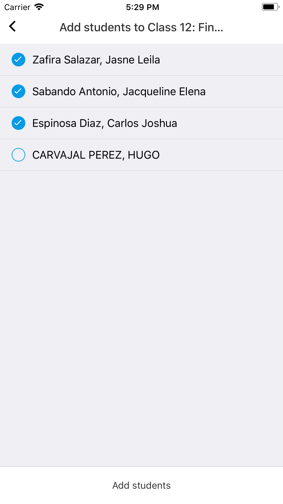
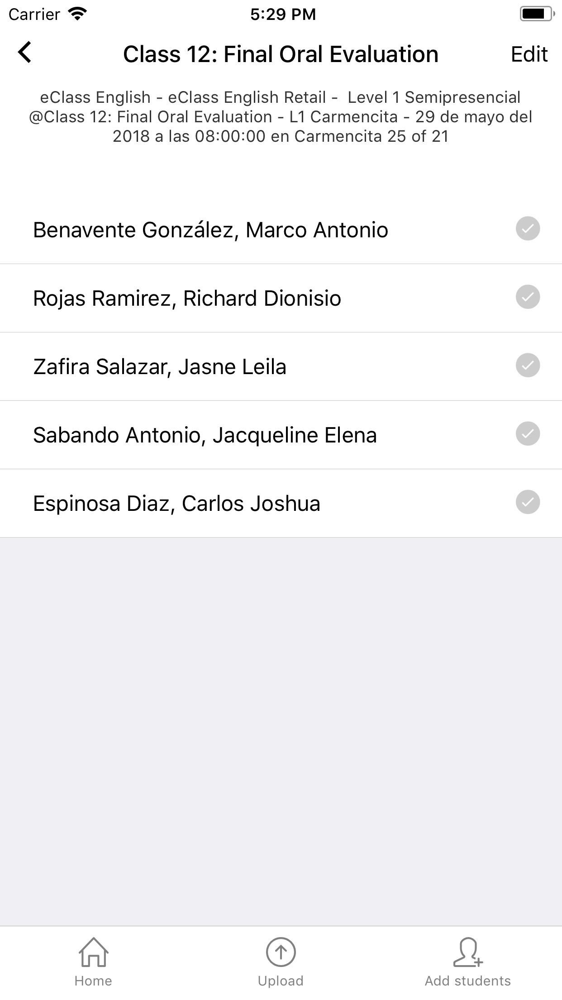

# Agregar alumnos

* Presionar el botón "Add students" de la barra de navegación inferior. 
Se abrirá una nueva pantalla con los alumnos disponibles para ser asignados a la clase. 
* Seleccionar cada uno y presionar el botón "Add students".

