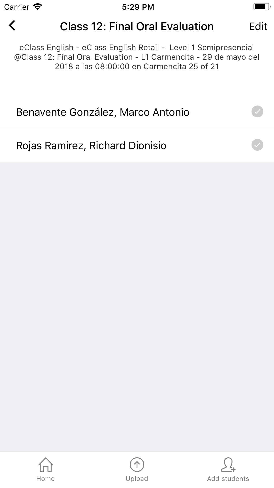

# Clase

Una vez seleccionada una clase es posible revisar y gestionar los alumnos asignados a ella.

Las acciones disponibles para esta vista son las siguientes:

* Revisar alumnos cargados
* Agregar nuevos alumnos
* Registrar asistencia como ausente o presente para cada alumno
* Asignar asistencia de forma masiva
* Subir la asistencia finalmente

