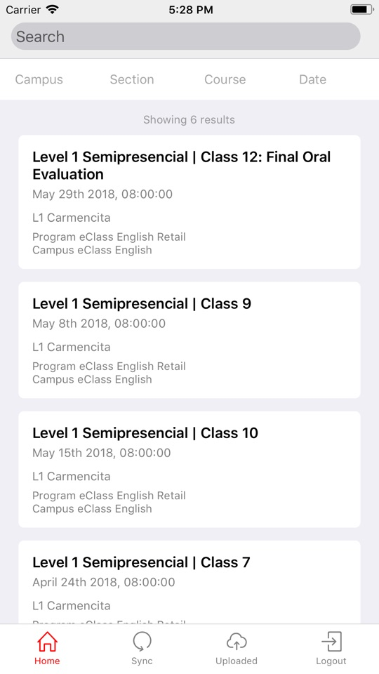
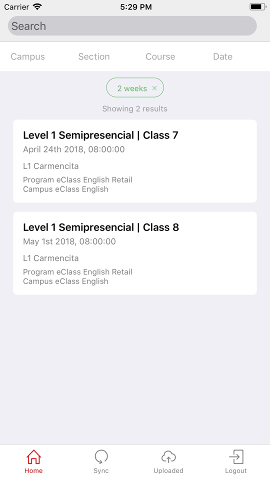
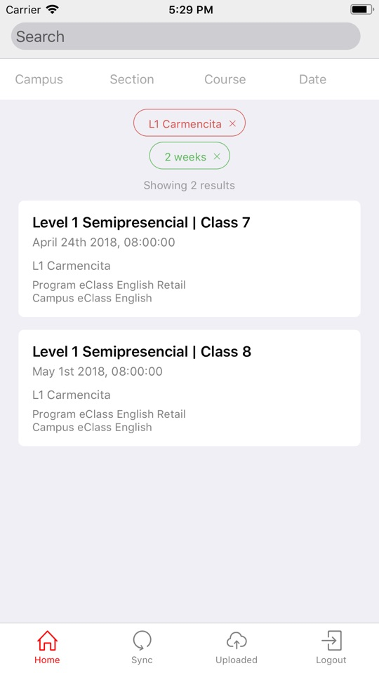

# Lista de clases o inicio

En la vista inicial se listan todas las clases asignadas al profesor.

Para buscar una clase en particular, utilizar el buscador de la parte superior. 
Ademas es posible utilizar los filtros superiores seleccionando el item de cada selector y generar un filtro 
para cada campus, sección, curso y/o fecha. 

Para el caso del selector fecha el filtro es aplicado para mostrar las clases que están dentro del plazo de 1 día, 1 semana o 2 semanas.

Una vez identificada la clase presionar sobre ella para ingresar y gestionar la asistencia.