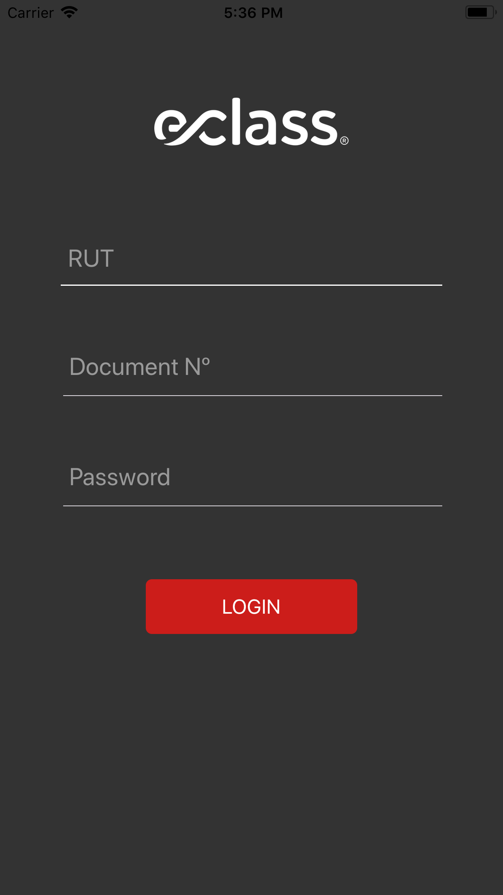
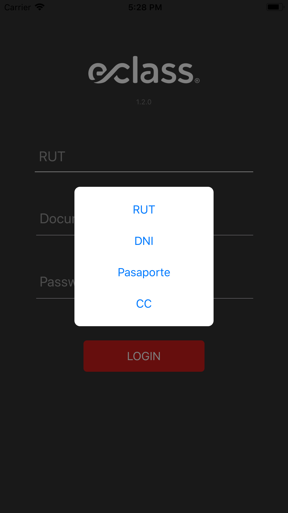

# Iniciar sesión

* Seleccionar tipo de documento (RUT, DNI, Pasaporte, CC). Si es de tipo RUT ingresar de forma completa, incluido 
el digito verificador.
* Ingresar el documento
* Ingrear contraseña personal
* Presionar el botón login para iniciar sesión.

Se mostrará un mensaje de error si los datos del usuarios son incorrectos o si hay problemas de conexión.

