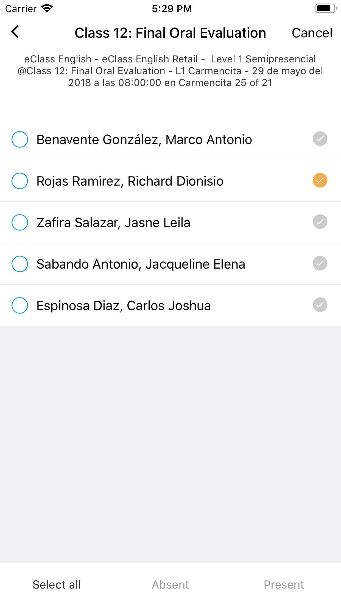
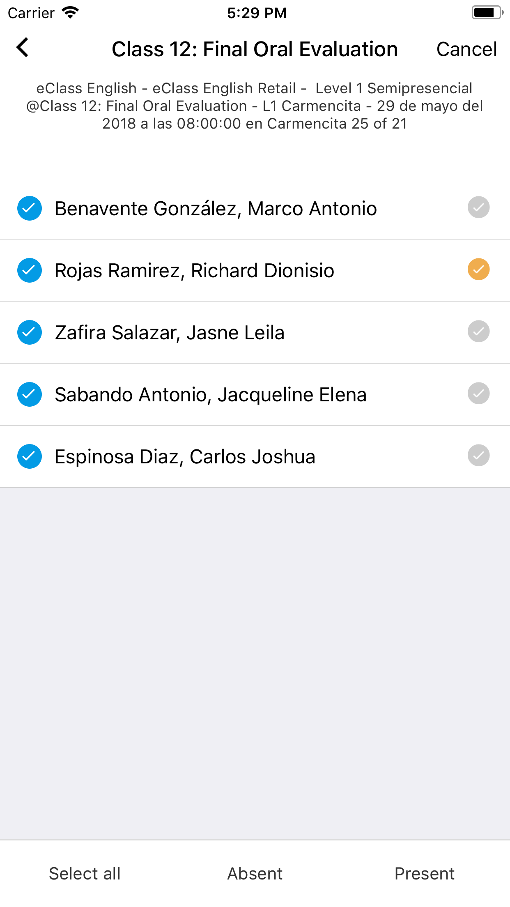
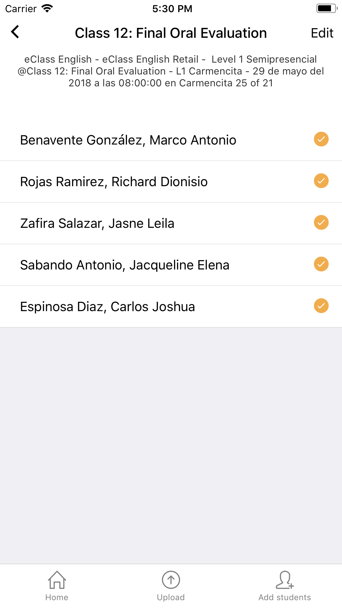

# Registrar asistencia de forma masiva

Al presionar el botón "Edit" de la parte superior derecha se activara el modo para registrar la asistencia de forma masiva.

* Marcar el circulo a la izquierda de cada alumno uno a uno o presionar sobre el botón "Select all" para marcar o desmarcar todos los alumnos de la clase.
* Seleccionar la opción como "Absent" o "Present" para los alumnos marcados.
* Finalmente la asistencia quedara registrada al seleccionar una de las opciones.

