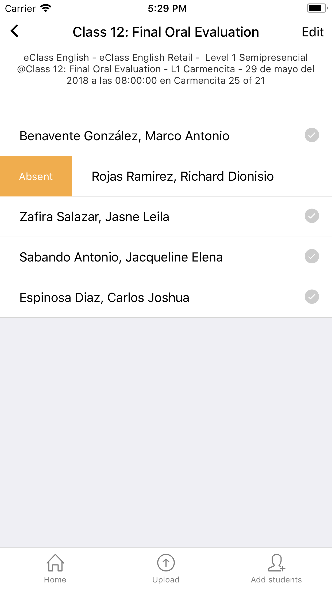
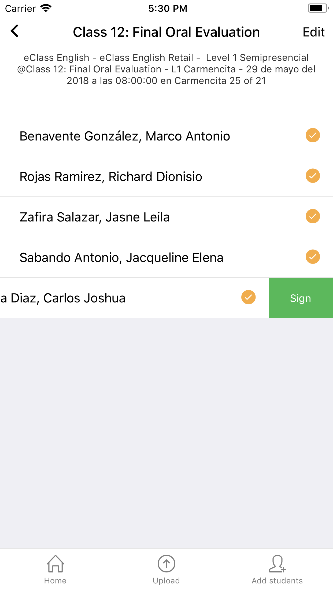
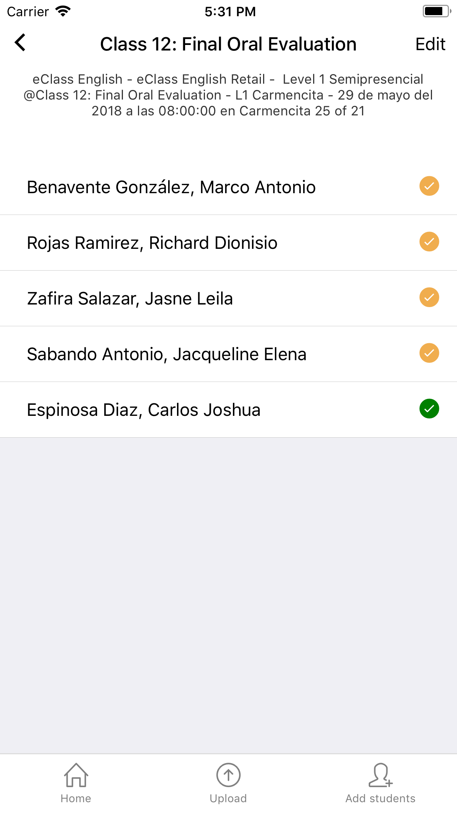

# Registrar asistencia individual

Para registrar la asistencia de cada alumno deslizar hacia la derecha para marcar al alumno como ausente. 
Deslizar hacia la izquierda permite marcar como presente. En este paso es necesario asignar una firma por el alumno.

