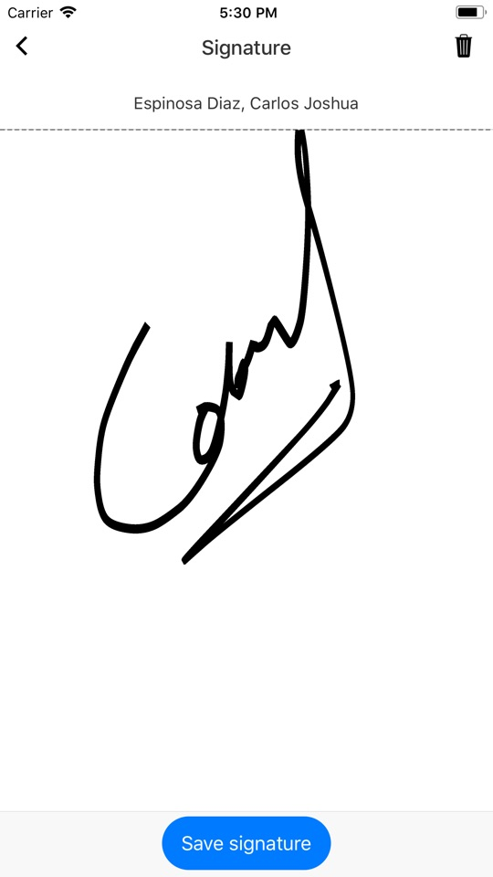

# Registrar firma del alumno

* Una vez cargada la pantalla de firma, dibujar la firma sobre el cuadro blanco principal y presionar el botón "Save signature". 
* Para borrar y volver dibujar un firma nueva, presionar el icono superior derecho (tarro de basura).

