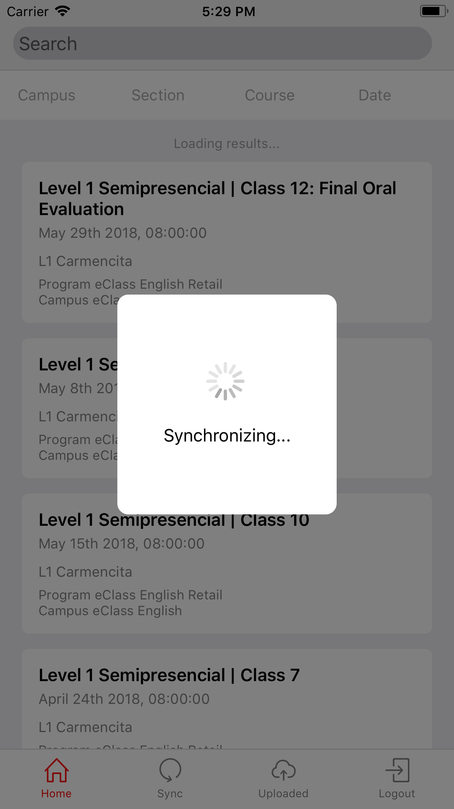

# Sincronizar clases

Para descargar la ultima información actualizada de las clases, presionar el botón de la barra de navegación "Sync". Esperar unos segundos para ver reflejados los cambios en la aplicación.

