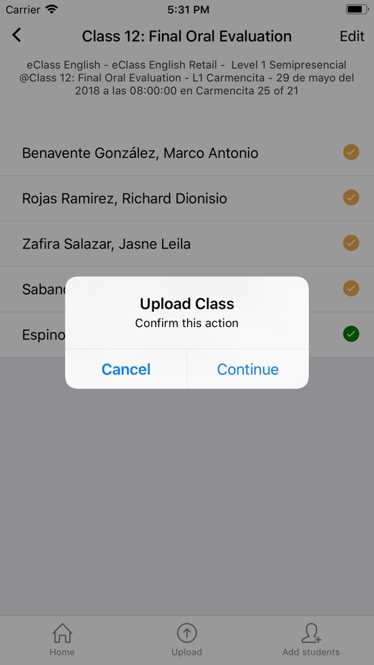

# Subir la asistencia registrada

Una vez que estén todos los estados marcados para los alumnos, es posible subir la asistencia. 

* Presionar el botón "Upload" (es necesario tener internet activado)
* Se abrirá un nuevo cuadro mostrando un mensaje si la subida fue correcta o se genero algún problema.

