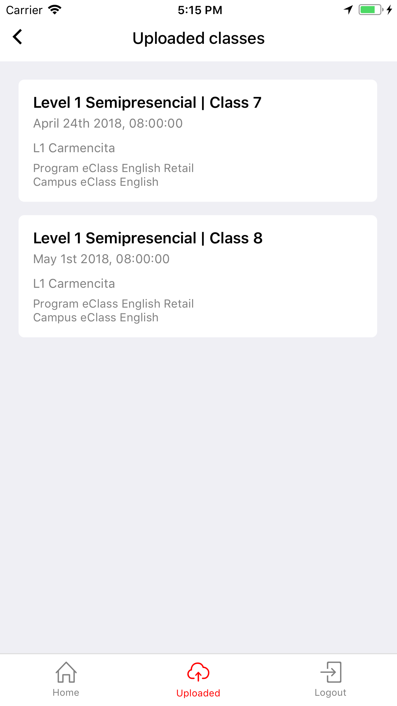

# Clases subidas

Ir a la pantalla inicial y presionar el botón "Uploaded" de la barra inferior de navegación. Esta pantalla mostrara una lista de todas las clases que se han subido desde la aplicación.

