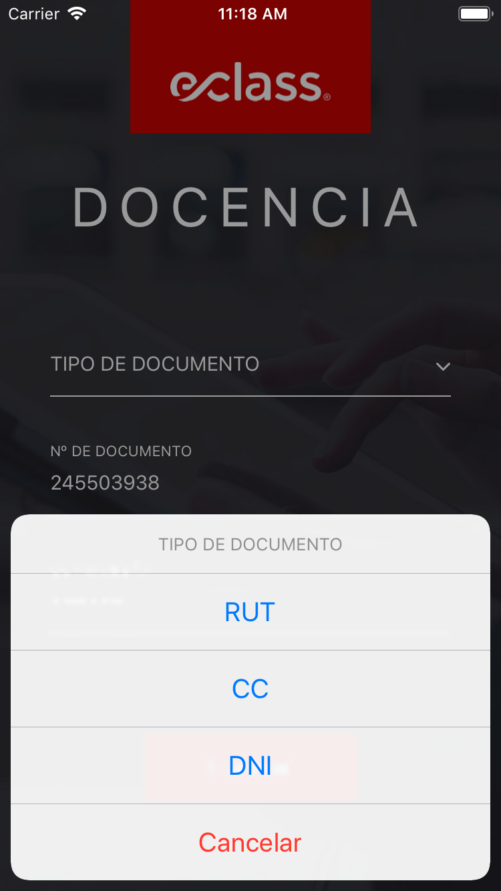
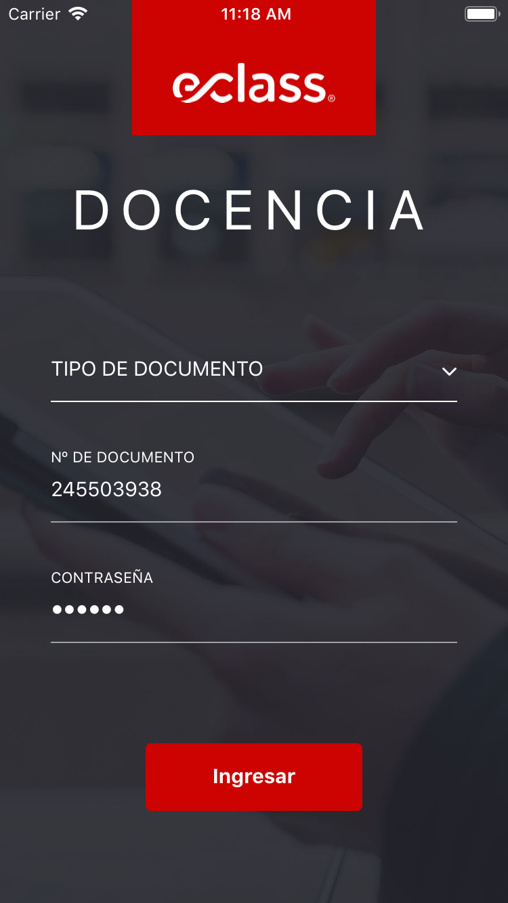

# Iniciar sesión

Luego de instalar la aplicación, el primer paso es ingresar los datos de usuario para iniciar sesión.

1. **Seleccionar tipo de documento (RUT, CC o DNI).**
2. **Ingresar el documento** (_Si es de tipo RUT ingresar de forma completa, incluido el dígito verificador._)
3. **Ingresar contraseña personal**
4. **Presionar el botón login para iniciar sesión.**

Se mostrará un mensaje de error si los datos del usuarios son incorrectos o si hay problemas de conexión.

